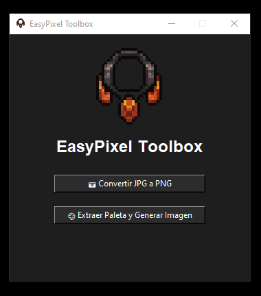
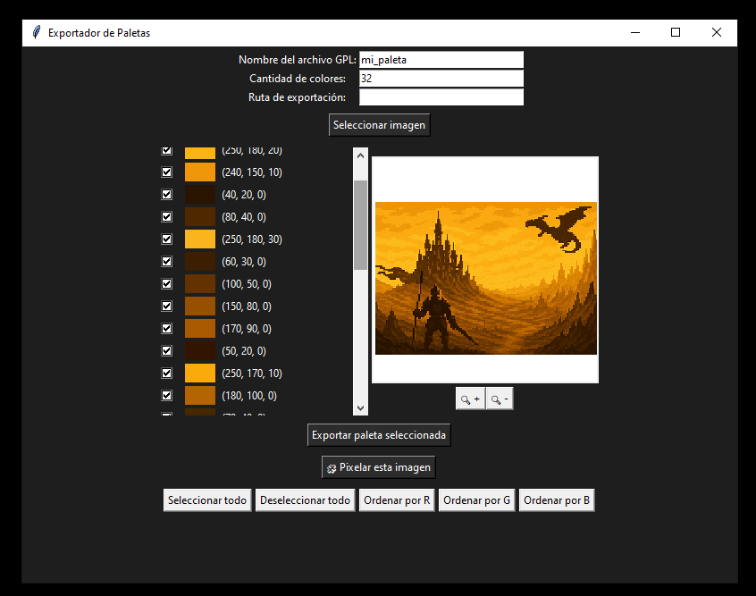
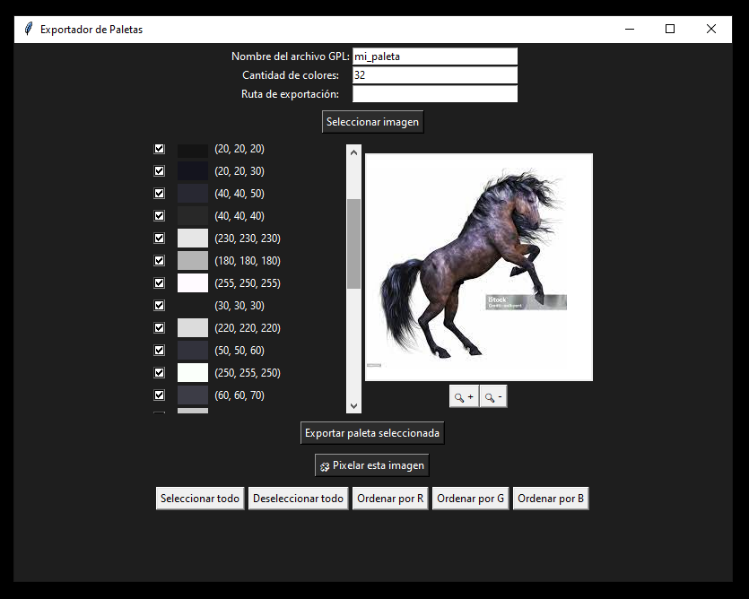
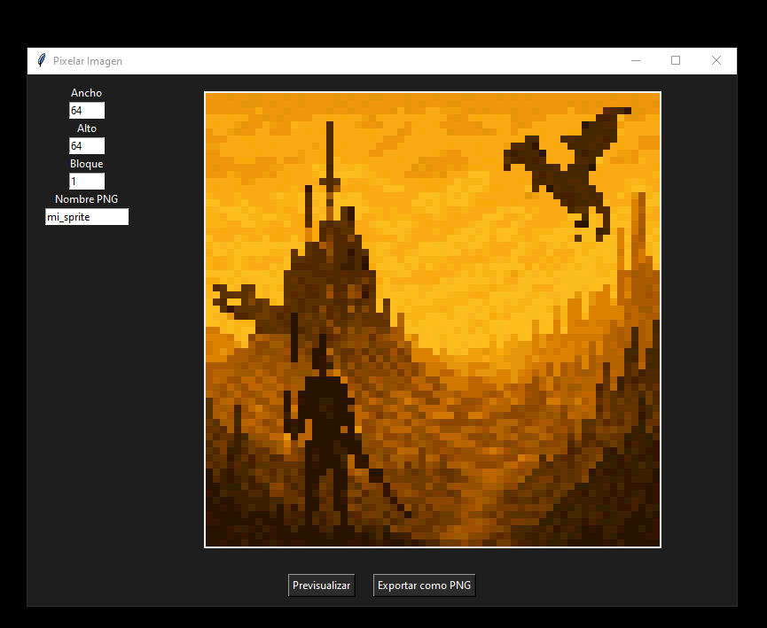
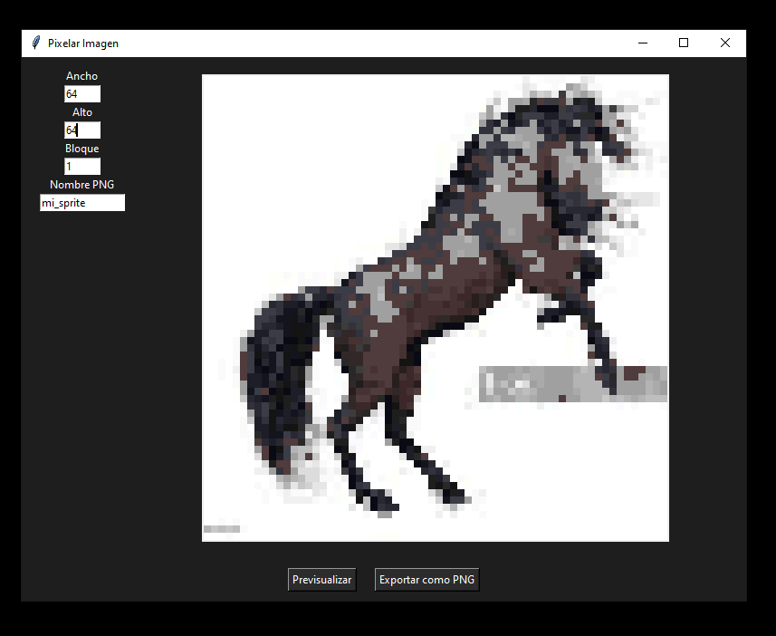
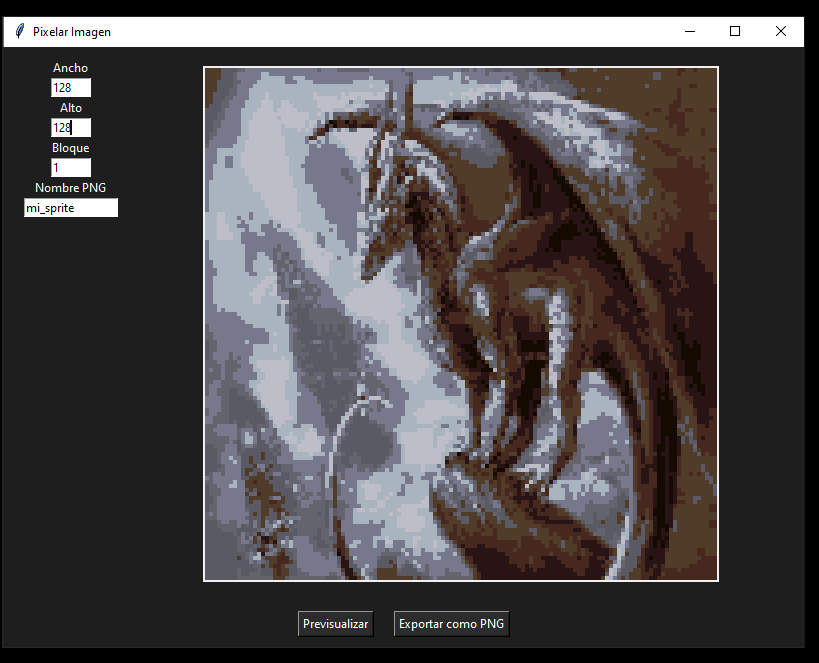

# README - EasyPixel Toolbox

## 🇬🇧 English Version

**EasyPixel Toolbox** is a graphical tool built with Python and Tkinter that allows artists, game developers, and pixel art enthusiasts to:

### 🎨 Features
- ✅ Convert `.jpg` images to `.png` easily
- ✅ Extract a color palette from any image
- ✅ Select and filter specific colors from the palette
- ✅ Save the palette as a `.gpl` (GIMP Palette) file
- ✅ Sort colors by RGB values
- ✅ Preview the image in zoom and drag it around
- ✅ Rebuild a pixelated version of the image using the selected palette
- ✅ Export pixelated result as a transparent `.png`

### 🔍 Usage Notes
- If you **select fewer colors** in the palette, the output will prioritize **silhouette and strong contrast**, ideal for sprite outlines and base shapes.
- If you **select more colors**, you'll preserve **light and shadow**, allowing the image to retain more depth.
- You can use this tool to **convert AI-generated images** into pixel-style images for games or stylized graphics.

### 🛠 Installation
1. Install Python 3.10+ and dependencies:
```bash
pip install -r requirements.txt
```
2. Run the app:
```bash
python main.py
```

3. (Optional) Build executable:
```bash
pyinstaller main.py --name EasyPixelToolbox --onefile --noconsole --add-data "assets;assets" --add-data "utils;utils" --add-data "ui;ui"
```

---

## 🇪🇸 Versión en Español

**EasyPixel Toolbox** es una herramienta visual construida con Python y Tkinter pensada para artistas, desarrolladores de videojuegos y amantes del pixel art.

### 🎨 Funciones
- ✅ Convertir imágenes `.jpg` a `.png`
- ✅ Extraer una paleta de colores desde cualquier imagen
- ✅ Seleccionar colores específicos de la paleta extraída
- ✅ Guardar la paleta como archivo `.gpl` compatible con GIMP
- ✅ Ordenar colores por valores RGB (Rojo, Verde, Azul)
- ✅ Previsualizar imagen con zoom y desplazamiento
- ✅ Reconvertir la imagen a pixel art usando solo la paleta elegida
- ✅ Exportar el resultado como `.png` con fondo transparente

### 🔍 Notas de Uso
- Si **usás pocos colores**, el sistema prioriza **siluetas y contraste fuerte**, útil para sprites básicos.
- Si **usás muchos colores**, se conserva más **luces y sombras**, ideal para pixel art con profundidad.
- También podés usar esta herramienta para **convertir imágenes generadas por IA** en versiones pixeladas, aprovechando la paleta limitada.

### 🛠 Instalación
1. Instalá Python 3.10+ y dependencias:
```bash
pip install -r requirements.txt
```
2. Ejecutá la aplicación:
```bash
python main.py
```

3. (Opcional) Compilá el ejecutable:
```bash
pyinstaller main.py --name EasyPixelToolbox --onefile --noconsole --add-data "assets;assets" --add-data "utils;utils" --add-data "ui;ui"
```

---

Enjoy creating beautiful retro art with precision! 🎮🧩

---

## 🖼️ Vista previa








---

## 🧑‍💻 Autor

Creado por **Martín Bozac** – [@HermanBozacDev](https://github.com/HermanBozacDev)
