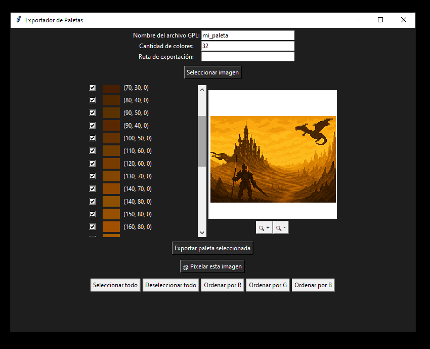

# 🧩 EasyPixel Toolbox

[➡️ Download latest version](https://github.com/HermanBozacDev/EasyPixelToolbox/releases/latest)

---

## 🇬🇧 English

**EasyPixel Toolbox** is a desktop tool for working with images in a pixel art workflow.

It allows you to:
- 🎨 Extract color palettes from PNG images
- 🧩 Rebuild the image using a limited color palette
- 🖼️ Convert JPG images to PNG
- 🔍 Preview images with zoom and drag
- 📁 Export to transparent `.png` or `.gpl` palette files

### Use cases:
- Great for reducing colors and outlining shapes from real images
- Ideal for cleaning up AI-generated images into usable pixel bases
- Fast palette extraction and post-processing for pixel art assets

✅ 100% open source – built in Python with Tkinter

---

## 🇪🇸 Español

**EasyPixel Toolbox** es una herramienta de escritorio para trabajar con imágenes dentro de un flujo de trabajo pixel art.

Permite:
- 🎨 Extraer paletas de colores desde imágenes PNG
- 🧩 Reconstruir la imagen usando una paleta limitada
- 🖼️ Convertir imágenes JPG a PNG
- 🔍 Previsualizar con zoom y desplazamiento
- 📁 Exportar a `.png` con fondo transparente o `.gpl` (paleta para GIMP/Aseprite)

### Casos de uso:
- Excelente para reducir colores y delimitar siluetas desde imágenes reales
- Ideal para transformar imágenes generadas por IA en base para pixel art
- Rápida extracción de paletas y postproducción

✅ 100% open source – hecho en Python con Tkinter

---

## 🛠️ Technologies
- Python 3.10+
- Pillow (PIL)
- Tkinter / ttkbootstrap
- PyInstaller

---

## 📦 Download
- [Download latest release](https://github.com/HermanBozacDev/EasyPixelToolbox/releases/latest) – Windows installer included

## 🙋 Contact
- GitHub: [HermanBozacDev](https://github.com/HermanBozacDev)
- LinkedIn: [martinhermanbozac](https://www.linkedin.com/in/martinhermanbozac/)
